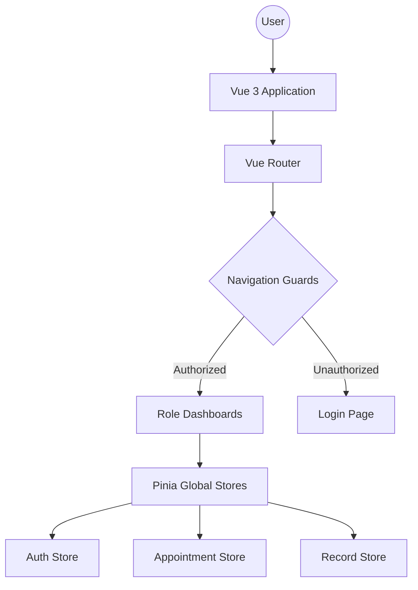
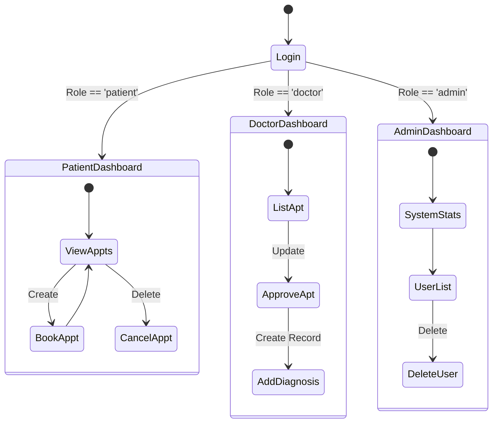
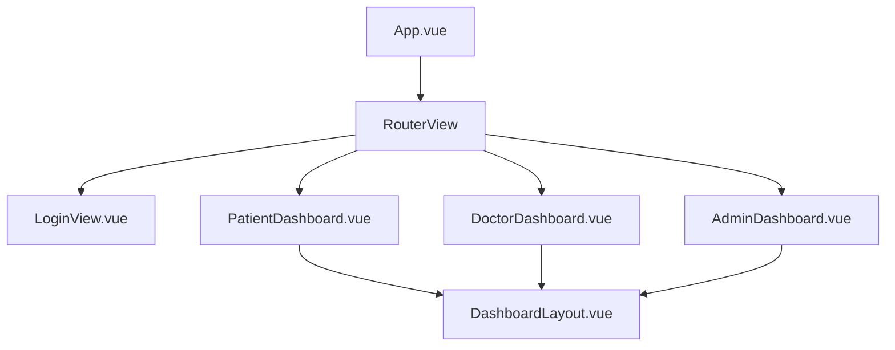
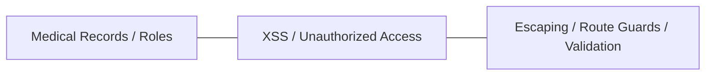

# MEDI-TRACK System Diagrams

## 1. System Architecture

```mermaid
graph TD
    User((User)) --> VueApp[Vue 3 Application]
    VueApp --> Router[Vue Router]
    Router --> Guards{Navigation Guards}
    Guards -->|Authorized| Views[Role Dashboards]
    Guards -->|Unauthorized| Login[Login Page]
    Views --> Stores[Pinia Global Stores]
    Stores --> AuthStore[Auth Store]
    Stores --> ApptStore[Appointment Store]
    Stores --> RecordStore[Record Store]
```

## 2. User Flow Diagram

```mermaid
stateDiagram-v2
    [*] --> Login
    Login --> PatientDashboard: Role == 'patient'
    Login --> DoctorDashboard: Role == 'doctor'
    Login --> AdminDashboard: Role == 'admin'
    
    state PatientDashboard {
        [*] --> ViewAppts
        ViewAppts --> BookAppt: Create
        BookAppt --> ViewAppts
        ViewAppts --> CancelAppt: Delete
    }
    
    state DoctorDashboard {
        [*] --> ListApt
        ListApt --> ApproveApt: Update
        ApproveApt --> AddDiagnosis: Create Record
    }
    
    state AdminDashboard {
        [*] --> SystemStats
        SystemStats --> UserList
        UserList --> DeleteUser: Delete
    }
```

## 3. Component Structure

```mermaid
graph TD
    App[App.vue] --> RouterView
    RouterView --> LoginV[LoginView.vue]
    RouterView --> DashP[PatientDashboard.vue]
    RouterView --> DashD[DoctorDashboard.vue]
    RouterView --> DashA[AdminDashboard.vue]
    
    DashP --> DashLayout[DashboardLayout.vue]
    DashD --> DashLayout
    DashA --> DashLayout
```

## 4. Threat Model Diagram

```mermaid
graph LR
    Assets[Medical Records / Roles] --- Threats[XSS / Unauthorized Access]
    Threats --- Mitigation[Escaping / Route Guards / Validation]
```
